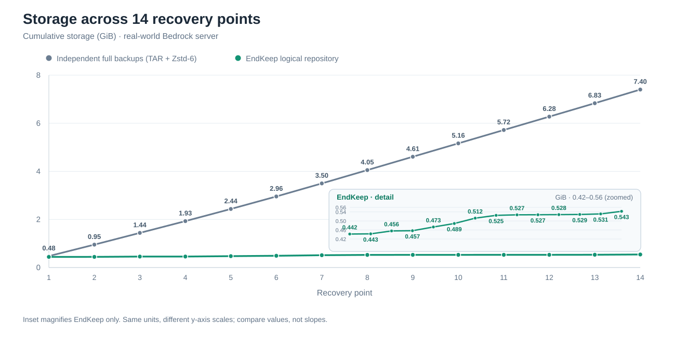

# Storage benchmark

A live Bedrock server retained **14 recovery points** (1 BASE and 13 DELTAs) over
**54.4 hours**, from October 6–8, 2026, using EndKeep v0.1.8.

| Storage for all 14 points | Size |
| --- | ---: |
| Restored full-world directories | 7.420 GiB |
| Independent full backups (TAR + Zstd-6) | 7.402 GiB |
| **EndKeep repository** | **0.543 GiB** |

**92.67% less storage** than independent Zstd-6 full backups (13.63× smaller).

<picture>
  <source media="(prefers-color-scheme: dark)" srcset="cumulative-storage-dark.svg">
  <source media="(prefers-color-scheme: light)" srcset="cumulative-storage.svg">
  
</picture>

The main chart compares both series in **GiB** on the same scale. A zoomed inset
labels each EndKeep recovery point, showing the small increments otherwise hidden
near the baseline. The EndKeep curve counts unique compressed BASE, DELTA and
sidecar objects; the headline total also includes repository metadata and disk overhead.

## Method

All 14 snapshots were restored independently. The complete worlds and EndKeep
repository were measured with `du -B1`; each restored world was separately
compressed using:

```sh
tar -C "$world" -cf - . | zstd -T1 -6 -q -c | wc -c
```

[Per-snapshot data (CSV)](snapshots.csv) includes the original byte measurements.
This is one real-server **storage** test, not a claim about backup speed or a
comparison with other cross-snapshot deduplicating tools.
